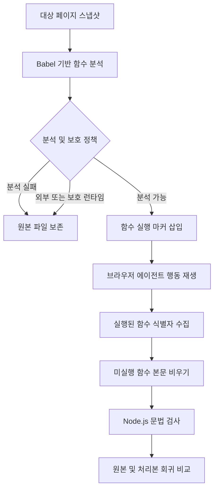

# 개선된 Muzeel의 구조와 구현 방법

## 무엇을 바꿨는가

원본 Muzeel은 브라우저에서 실행되는 JavaScript 함수를 기록한 뒤 실행되지
않은 함수 본문을 비우는 블랙박스 방식의 도구다. 소스 코드 저장소를 알지
못해도 배포된 JavaScript를 대상으로 동작한다는 장점이 있다.

이번 개선판은 원본의 실행 기록과 제거 방식을 유지하면서 다음 문제를
해결한다.

1. 최신 Next.js 번들 문법을 끝까지 읽을 수 있어야 한다.
2. 분석 도중 오류가 난 파일을 부분 분석 결과로 제거하면 안 된다.
3. 화살표 함수와 클래스 메서드와 객체 메서드를 추적해야 한다.
4. 에이전트가 실제 화면 의미를 보고 안전한 상호작용을 선택해야 한다.
5. 외부 분석 도구와 인증 도구와 모니터링 런타임을 기본적으로 보존해야 한다.
6. 제거 후 JavaScript 문법과 사용자 동작을 원본과 비교해야 한다.

## 처리 흐름



## 최신 JavaScript 분석

원본은 Python Esprima를 사용한다. 이 파서는 optional chaining과 nullish
coalescing을 포함한 최신 문법을 만나면 중단될 수 있다. 원본 구현은 중단
전에 방문한 함수 정보를 계속 사용하므로 한 파일을 완전히 이해하지 못한
상태에서도 제거를 진행할 위험이 있다.

개선판은 [`modern_js_functions.mjs`](../modern_js_functions.mjs)에서 Babel
Parser를 호출한다. JavaScript와 TypeScript와 Flow 파싱을 순서대로 시도하고
함수 본문 위치를 JSON으로 반환한다. Python 코드는
[`ModernFunctionParser.py`](../ModernFunctionParser.py)를 통해 이 결과를
받는다.

JavaScript 파서의 위치 값은 UTF-16 코드 단위다. Python 문자열 인덱스는
유니코드 코드 포인트 단위이므로 이모지처럼 두 개의 UTF-16 코드 단위를
사용하는 문자가 있으면 위치가 어긋날 수 있다. 브리지에서는 UTF-16 위치를
Python에서 사용할 코드 포인트 위치로 변환한다.

## 실행 기록 방식

블록 본문에는 다음 형태의 마커를 삽입한다.

```js
globalThis.__muzeelMark("script URL | body start | body end");
```

함수 안의 `use strict` 같은 지시문은 반드시 본문의 맨 앞에 있어야 효력이
유지된다. 개선판은 지시문이 끝난 뒤 마커를 넣는다.

본문이 블록이 아닌 간결한 화살표 함수는 반환값을 바꾸지 않도록 sequence
expression으로 감싼다.

```js
const read = value => (
  globalThis.__muzeelMark("function id"),
  value?.name
);
```

실행 식별자는 `globalThis`의 메모리 집합에 저장한다. 원본처럼
`localStorage`에 함수별 키를 계속 추가하지 않으므로 저장 공간과 사이트
상태에 미치는 영향을 줄인다.

## 안전 정책

### 분석 실패 시 원본 보존

파서가 파일 전체를 읽지 못하면 함수 지도를 비워 두고 파일을 변경하지
않는다. 분석 실패는 제거 후보가 많다는 뜻이 아니라 증거가 없다는 뜻으로
처리한다.

### 외부 스크립트 보존

페이지와 출처가 다른 JavaScript는 기본적으로 변경하지 않는다. 한 페이지의
행동 기록만으로 독립 배포되는 분석과 인증과 위젯 코드를 제거하는 것은
안전하지 않기 때문이다.

### 보호 런타임 보존

동일 출처 번들이어도 모니터링 초기화 코드가 포함될 수 있다. 기본값은
`Sentry` 문자열을 포함한 번들을 보존한다. 호출자는 `db_details`의
`protected_content_markers`를 통해 사이트에 맞는 보호 문자열을 지정할 수
있다.

이 정책은 Solid Connection 실험에서 발견된 문제를 바탕으로 추가됐다.
외부 스크립트까지 공격적으로 처리하면 Google Tag Manager 오류가 발생했고
외부 파일만 보존하면 앱 번들 안의 Sentry 초기화가 제거돼 Sentry 오류가
발생했다.

## 함수 제거 방식

실행되지 않은 블록 함수는 중괄호를 유지하고 내부만 비운다. 간결한 화살표
함수 본문은 `void 0`으로 교체한다. 사용하지 않은 외부 함수가 제거되면 그
안의 중첩 함수도 함께 사라지므로 같은 범위를 중복해서 수정하지 않는다.

## 검증

로컬 단위 테스트는 다음 명령으로 실행한다.

```sh
npm install
python3 -m unittest -v test_modern_parser.py test_modern_datastore.py
node --check modern_js_functions.mjs
```

테스트는 최신 문법과 한글 위치 계산과 파싱 실패 보존과 외부 스크립트
보존과 모니터링 런타임 보존과 제거 후 문법을 확인한다.

실제 사이트에서는 모든 처리 파일에 `node --check`를 실행하고 원본과
처리본에 같은 브라우저 회귀 시나리오를 적용한다. 기능 테스트가 통과해도
콘솔에 새 오류 종류가 생기면 안전한 결과로 간주하지 않는다.

## 현재 한계

- 한 번 실행되지 않았다는 사실만으로 코드가 영원히 불필요하다고 증명할 수 없다.
- 로그인 이후 상태와 시간 기반 기능과 실험군 기능은 별도로 탐색해야 한다.
- 동적 import로 나중에 내려받는 번들은 해당 경로를 실행하지 않으면 수집되지 않는다.
- 보호 문자열은 일반화된 완전한 해법이 아니며 사이트별 런타임 분류가 필요하다.
- Solid Connection 사례는 모바일 크기의 홈 화면 스냅샷 한 개를 대상으로 했다.
- 원본 저장소에는 별도 라이선스 파일이 없으므로 이 포크도 새 라이선스를 임의로 선언하지 않는다.
