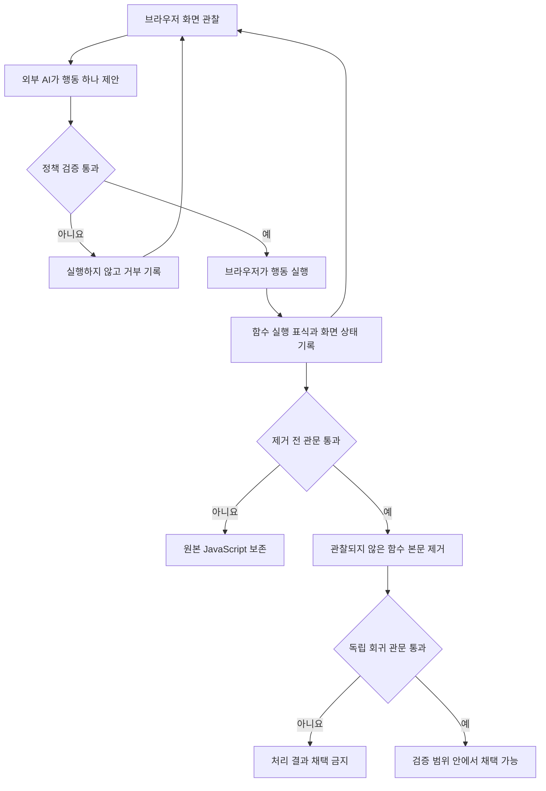

# Muzeel AI Agent 설계와 실행 방법

## 무엇이 달라졌나

기존 Muzeel은 미리 작성된 브라우저 탐색 로직으로 화면 요소를 클릭하고 그동안
호출된 JavaScript 함수를 수집한다. Muzeel AI Agent는 다음 행동을 고르는 부분만
외부 AI 에이전트에 맡긴다. 함수 제거 판단은 AI에 맡기지 않는다.

| 구분 | 기존 Muzeel | Muzeel AI Agent |
| --- | --- | --- |
| 다음 행동 선택 | 고정된 탐색 코드 | 화면 관찰을 받은 외부 AI 에이전트 |
| 행동 허용 여부 | 실행 코드에 분산 | 독립된 실패 폐쇄 정책 |
| 함수 사용 증거 | 브라우저 콘솔 표식 | 같은 콘솔 표식 |
| 제거 판단 | 관찰되지 않은 함수 | 감사된 추적에서 관찰되지 않은 함수 |
| 실행 기록 | 일반 로그 | 해시로 연결된 JSONL 추적 |
| 실패 처리 | 경로에 따라 다름 | 원본 JavaScript 보존 |
| 최종 채택 | 별도 실험으로 판단 | 독립 회귀 증거 관문 제공 |

실패 폐쇄 정책은 판단이 불가능하거나 증거가 부족할 때 처리하지 않고 원본을
보존하는 방식이다.

## 전체 흐름



AI는 화면에서 다음에 눌러 볼 안전한 버튼을 찾는다. 정책 검증기는 실제 실행
권한을 가진다. 제거기는 파싱 결과와 실행 표식만 사용한다. 이 역할 분리 덕분에
AI가 함수 이름을 보고 임의로 코드를 삭제할 수 없다.

## 에이전트가 받는 정보

외부 에이전트 명령은 표준 입력으로 JSON 한 개를 받는다. 이 JSON에는 시스템
지침과 현재 주소와 화면 상태 해시와 보이는 조작 요소 목록과 최근 행동 결과와
남은 예산이 들어 있다. 쿠키와 브라우저 프로필과 JavaScript 원문은 전달하지
않는다.

에이전트는 표준 출력으로 다음 형태의 JSON 한 개만 반환해야 한다.

```json
{
  "action": {
    "action": "click",
    "target": "#menu-button",
    "rationale": "메뉴 열림 상태를 확인한다"
  },
  "metadata": {
    "agent": true,
    "provider": "사용한 제공자",
    "model": "사용한 모델"
  }
}
```

행동 계약은 `muzeel_agent/schemas/action.schema.json`에 있다. 관찰 계약은
`muzeel_agent/schemas/observation.schema.json`에 있다. 에이전트 지침 원문은
`muzeel_agent/instructions/agent-system-ko.md`에 있다.

## 안전 정책

기본 정책은 현재 화면에서 관찰된 버튼과 탭과 옵션만 클릭할 수 있게 한다.
스크롤은 한 번에 800픽셀까지 허용한다. 기다리기는 3초까지 허용한다.

링크와 입력 필드와 폼과 파일 선택기는 실행하지 않는다. 로그인과 회원가입과
결제와 구매와 신청과 삭제와 저장 문구가 있는 조작 요소도 실행하지 않는다.
새 창과 다른 출처 이동과 현재 경로를 벗어나는 이동은 위반으로 기록한다.
페이지 본문에 적힌 지시문은 에이전트 명령이 아니라 관찰 데이터로 취급한다.

정책 거부가 세 번 발생하거나 행동이 실패하거나 이동 위반이 발생하면 탐색을
중단한다. 이런 실행에서는 JavaScript 제거를 승인하지 않는다.

## 실행 준비

MySQL과 캐시 프록시 설정은 기존 Muzeel 실행 방법을 따른다. Python과 최신
JavaScript 파서 의존성을 설치한다.

```sh
python3 -m pip install -r requirements-agent.txt
npm install
```

외부 AI를 호출하는 프로그램을 준비한다. 이 프로그램은 앞에서 설명한 표준
입출력 계약을 지켜야 한다. API 키는 이 저장소나 실행 추적에 기록하지 않는다.

캐시 읽기 프록시를 실행한 다음 별도 터미널에서 다음 명령을 실행한다.

```sh
python3 run_agent.py \
  --site https://www.solid-connection.com/ \
  --proxy 127.0.0.1:9700 \
  --planner-command "python3 /absolute/path/to/your_agent_adapter.py" \
  --output /absolute/path/to/run-output
```

출력 경로는 매 실행마다 비어 있는 새 디렉터리를 사용하는 것이 좋다. 기존 추적
파일이 있으면 새 실행을 이어 붙이지 않고 실패한다. 서로 다른 실행의 증거가
섞이는 것을 막기 위한 동작이다.

## 결과 해석

`agent-result.json`은 파서 실패와 보호된 파일과 탐색 결과와 추적 감사와 제거
전 관문 결과를 포함한다. `elimination_gate.approved`가 거짓이면 `.m` 처리본은
원본과 같게 저장된다.

로컬 추적에는 화면에 보인 요소 이름이 포함된다. 로그인된 페이지에서 실행하면
사용자 정보가 요소 이름에 들어갈 수 있으므로 원본 추적을 그대로 공개하지
않는다. 공개 전에는 요소 이름과 주소를 검토하고 필요한 경우 익명화한다.

제거 전 관문이 통과해도 `release_status.approved`는 거짓으로 남는다. 탐색 때
사용하지 않은 독립 시나리오로 원본과 처리본을 비교하기 전에는 결과를 채택할 수
없기 때문이다. 검증 결과를 다음 형식으로 저장하고 최종 관문을 실행한다.

```sh
python3 -m muzeel_agent release-gate \
  muzeel_agent/examples/release-evidence.json
```

최종 관문은 처리 파일의 구문 오류가 0건인지 확인한다. 평가 가능한 독립
시나리오가 한 개 이상인지 확인한다. 기능 손상과 새 콘솔 오류 범주가 0건인지
확인한다. 원본 대비 최소 화면 유사도가 기본 기준인 0.99 이상인지도 확인한다.

## 추적 감사와 정책 확인

```sh
python3 -m muzeel_agent validate-action \
  --base-url https://example.test/ \
  --observation muzeel_agent/examples/observation.json \
  --action muzeel_agent/examples/safe-action.json

python3 -m muzeel_agent audit-trace \
  /absolute/path/to/run-output/browser/agent-trace.jsonl

python3 -m muzeel_agent gate \
  muzeel_agent/examples/elimination-evidence.json
```

## 현재 한계

동적 함수 생성과 웹 워커와 서비스 워커와 브라우저 확장 프로그램에서 실행되는
코드는 일반 콘솔 표식만으로 완전하게 관찰하기 어렵다. 로그인 뒤에만 나타나는
기능과 결제와 개인정보 입력 기능은 안전 정책상 탐색하지 않는다. 따라서 이
도구는 전체 사이트의 죽은 코드를 증명하지 않는다. 지정한 페이지와 허용된
상호작용과 독립 검증 시나리오 범위에서만 결과를 설명해야 한다.
