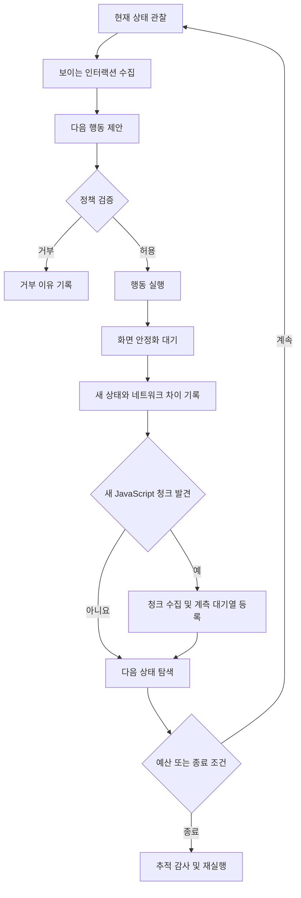

# 상태 기반 탐색과 동적 JavaScript 청크 추적 연구 설계

## 연구 배경

웹 페이지의 인터랙션 요소는 처음 화면에 모두 존재하지 않는다. 버튼을 눌러야
모달이 생기고 모달 안에서 다시 버튼이나 입력란이 나타날 수 있다. 이때 브라우저는
초기 응답에 없던 JavaScript 청크를 동적으로 내려받기도 한다.

초기 화면에서 찾은 요소만 실행하면 나중에 생긴 모달과 오류 화면과 지연 로딩
기능을 탐색하지 못한다. 해당 경로에서만 실행되는 함수가 미실행 함수로 분류될
수 있으므로 JavaScript 제거의 안전성도 낮아진다.

이번 연구의 목적은 행동 이후에 바뀐 화면을 다시 읽고 새 인터랙션과 새
JavaScript 청크를 같은 상태 전이로 기록하는 것이다. AI Agent가 함수 제거를
판단하지는 않는다. Agent는 허용된 행동을 제안하며 함수 사용 여부는 계측된
브라우저 실행 기록으로만 판단한다.

## 연구 질문

### RQ1. 상태 재탐색은 초기 화면 탐색보다 실행 경로를 더 많이 발견하는가

행동 이후의 DOM과 접근성 트리를 다시 읽었을 때 고유 화면 상태와 인터랙션
요소와 실행 함수 수가 얼마나 증가하는지 측정한다.

### RQ2. AI Agent는 규칙 기반 재탐색보다 의미 있는 상태를 더 많이 찾는가

단순히 새 요소를 순서대로 클릭하는 규칙 기반 탐색과 화면 의미를 보고 다음
행동을 고르는 AI Agent를 같은 행동 횟수와 시간으로 비교한다.

### RQ3. 동적 청크 추적은 기능 손상을 줄이는가

행동 때문에 새로 요청된 JavaScript를 수집하고 계측했을 때 독립 회귀
시나리오의 기능 손상과 새 콘솔 오류가 줄어드는지 확인한다.

## 비교 대상

| 구분 | 탐색 방법 | 행동 이후 재관찰 | 동적 청크 연결 |
| --- | --- | --- | --- |
| 원본 Muzeel | 기존 이벤트 탐색 | 명시적 상태 그래프 없음 | 행동 단위 연결 없음 |
| 규칙 기반 재탐색 | 새 요소를 정해진 순서로 실행 | 있음 | 있음 |
| AI Agent 재탐색 | 화면 의미와 이력을 보고 행동 선택 | 있음 | 있음 |

AI Agent와 원본만 비교하면 단순한 DOM 재탐색만으로도 같은 결과를 얻을 수
있다는 반론을 구분할 수 없다. 따라서 규칙 기반 재탐색을 반드시 비교군으로
둔다.

## 상태 전이 수집 과정

각 행동은 행동 전후의 상태 식별자와 정책 판단과 새 요소 수와 네트워크 요청과
새 청크와 함수 실행 증가량을 기록한다. 공개 자료에는 DOM 원문과 쿠키와
JavaScript 본문을 넣지 않는다. 주소와 선택자도 공개가 필요한 경우 해시 또는
익명 식별자로 바꾼다.

## 동적 청크 처리 방식

새 청크는 이미 브라우저에서 실행된 뒤에 발견될 수 있으므로 한 번의 실행만으로
계측 결과를 얻을 수 없다. 다음 반복 구조를 사용한다.

1. 원본 응답을 유지한 상태에서 탐색해 새 청크와 상태를 발견한다.
2. 발견한 청크를 Babel로 완전히 파싱한다.
3. 파싱 실패와 외부 출처와 보호 런타임은 원본으로 보존한다.
4. 계측한 스냅샷에서 같은 상태 전이를 다시 실행한다.
5. 실행된 함수 식별자와 새로 발견된 청크를 합친다.
6. 새로운 청크가 없거나 반복 예산에 도달할 때까지 수행한다.

동적 청크 요청이 실패하거나 같은 행동을 재현할 수 없으면 제거 관문을
통과시키지 않는다.

## 모달 예시

초기 화면에서 로그인 버튼을 클릭해 모달이 열렸다고 가정한다. 상태 재탐색은
모달의 닫기 버튼과 아이디 입력란과 비밀번호 입력란과 제출 버튼을 새 요소로
기록한다. 기본 안전 정책에서는 입력과 제출을 실행하지 않는다. 허가된 테스트
계정과 별도 실험 정책이 있을 때만 성공과 실패 입력 시나리오를 실행한다.

모달을 여는 행동으로 `login-modal` 청크가 요청됐다면 해당 청크를 행동과
연결한다. 이후 오류 화면과 성공 화면을 서로 다른 상태로 기록하고 각 상태에서
실행된 함수의 합집합을 제거 판단에 사용한다.

## 평가 지표

- 고유 화면 상태 수
- 발견한 인터랙션 요소 수
- 실제 실행한 행동 수와 실패 수
- 새로 발견한 JavaScript 청크 수와 바이트 수
- 파싱 및 계측에 성공한 청크 수
- 관찰된 함수 수와 행동별 함수 증가량
- 처리 후 JavaScript 감소율
- 독립 회귀 시나리오 통과율
- 새 콘솔 오류 범주와 기능 손상 수
- 최소 화면 유사도
- 탐색 시간과 Agent 호출 횟수와 비용

## 주장 범위

페이지의 모든 인터랙션을 탐색했다고 주장하지 않는다. 입력 조합과 사용자
권한과 서버 응답과 시간에 따라 상태가 계속 늘어날 수 있기 때문이다. 결과는
정해진 행동 예산과 시간 예산과 허용 정책 안에서 도달한 상태에 한정한다.

미실행 함수는 영구적인 dead code가 아니라 이번 탐색에서 관찰되지 않은
함수라고 표현한다. 운영 배포 가능 여부는 별도의 회귀 테스트와 장기 관찰로
판단한다.

## 현재 상태

Solid Connection 홈 화면에서는 AI Agent 12행동과 독립 회귀 시나리오 다섯
개를 실행했다. 하지만 행동별 신규 청크와 함수 증가량을 연결한 상태 전이
데이터는 아직 수집하지 않았다. 이 문서는 다음 구현과 비교 실험을 위한 연구
계약이다.
